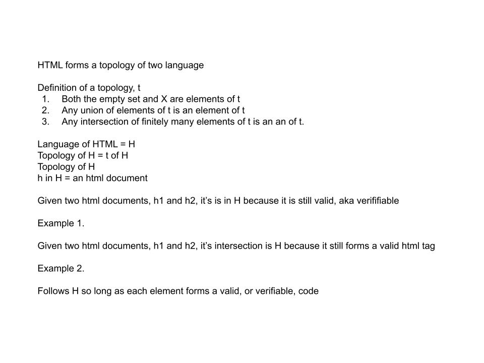
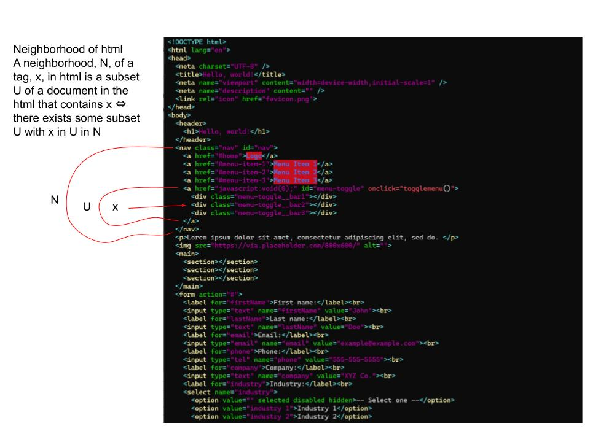
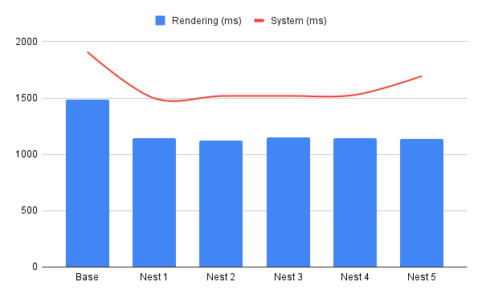

# Topology For Software Engineers

### 1. Topology For Software Engineers

### 2. The Basis Of HTML

### 3. Neighborhood Of Topology

### 4. A Small Experiment with Huge Documents of Nested Levels

Performance of various layouts of an html page are given knowing that there is theory behind topology would provide insight into the optimal performance of an html page especially when the size of the document can be massive.

### 5. Hypothesis and Objective
Given a sample of html documents with different levels of nested queries of depth zero, one, two, three, four, five, and eight find the relation of the performance of the loading the page. There are five levels of nests in the five html samples and the performance is being measured. The objective is to show how the topology of the website on a large html document has on performance.

### 6. Testing Documents
[Test Base](Resources/test01nest0b.html)\
[Test 1 Nest](Resources/test01nest01.html)\
[Test 2 Nest](Resources/test01nest02.html)\
[Test 3 Nest](Resources/test01nest03.html)\
[Test 4 Nest](Resources/test01nest04.html)\
[Test 5 Nest](Resources/test01nest05.html)\
[Test 8 Nest](Resources/test01nest08.html)\
[Test 24 Nest](Resources/test01nest24.html)

[test.csv](Resources/test.csv)

### 7. Conclusion

The resulting tests for each document shows that at the base level, the html document renders slower than if it has no div tags than if it had more than one. On the other hand, when the nests are of 8 or more, performance dramatically decreases. This could be do to many explanations and leaves much room to explore and hypothesis given the different amount of topologies available for an html document.

-----

# References

Sipser, M. (2012). Introduction to the theory of computation (3rd ed.). Cengage Learning.

Munkres, J. R. (2000). Topology (2nd ed.). Prentice Hall.

V. Stoltenberg-Hansen; I. Lindstrom; E. R. Griffor (1994). Mathematical Theory of Domains. Cambridge University Press. ISBN 0-521-38344-7.
